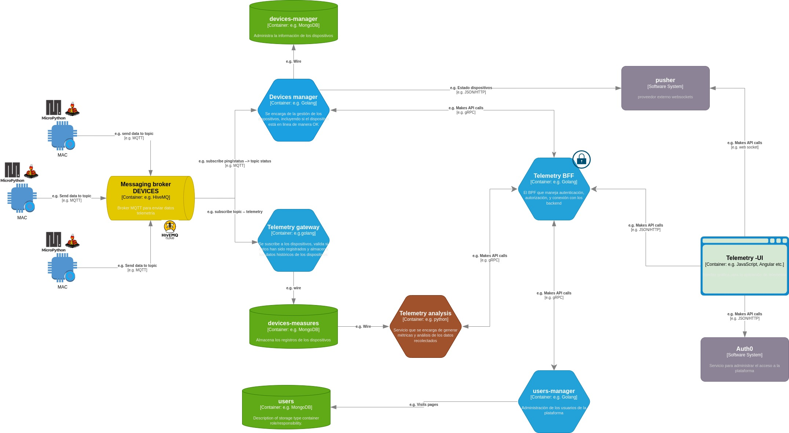
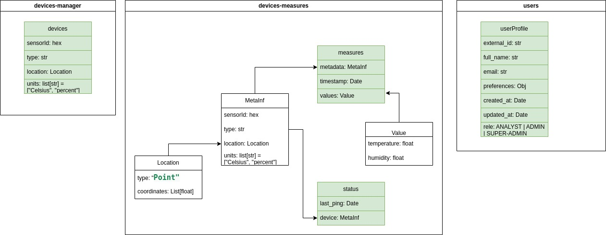

# Diseño del sistema

## Introducción
Es una aplicación que permitirá el monitoreo de variables del ambiente como temperatura, y humedad relativa mediante un sistema completo de gestión de usuarios, dispositivos, datos en tiempo real y análisis de estadísticas sobre los históricos de los datos.

## Requisitos funcionales
* Dispositivos ESP32 conectados a internet envían información de variables de temperatura, y humedad cada 15 minutos.
* Una aplicación web que permita acceder por medio de roles donde se restringirán ciertas funcionalidades.
* El role ADMIN permite la administración de los dispositivos agrupados por regiones geográficas, CRUD de dispositivos,     monitoreo de dispositivos si están operando o no. Y también puede ver todo lo que hace el ANALYST.
* El role ANALYST permite monitorear dispositivos en tiempo real la información de las variables temperatura y humedad de un dispositivo individual, o agrupados por regiones.

* El role SUPER ADMIN permite el CRUD de usuarios y tiene acceso a las funcionalidades del ADMIN y el ANALYST.
Adicional a los datos en tiempo real del sistema se pueden hacer análisis de IA con el histórico de los datos.

* El acceso a la aplicación web debe tener un SSO con algún proveedor.

## Requisitos no funcionales
* La cantidad de usuarios inicialmente serán 5 que pueden ser concurrentes
* La cantidad de dispositivos podría ser 1000.
* Cada dispositivo envía 1Kb de información 1Kb * 4 * 1000 = 4Mb/hr al año podría ser 33GB de información.
* La latencia de datos en tiempo real debe ser < 500 ms.
Se puede tolerar pérdida de registros de dispositivos.
* Se deben cumplir medidas de seguridad como restricción de acceso a las API.
* Se deben usar protocolos de comunicación ligeros ya que los dispositivos ESP32 son limitados en recursos.

## Mapa de componentes
El sistema completo se compone de 6 microservicios, 1 interfaz web, y 1 servicio programado en los dispositivos que se conectan entre sí a través de diferentes protocolos como MQTT, gRPC, REST.

### Stack de tecnologías
- Golang para manejar los microservicios que recolectan la información, gestionan usuarios y dispositivos, así como el BFF (Backend For Frontend)
- Python para el análisis de datos registrados
- MongoDB como gestor de bases de datos NoSQL
- HiveMQ como broker de mensajería MQTT
- Auth0 como proveedor de autenticación
- Pusher como proveedor del websocket

## Modelado de datos

### Requisitos datos
- El sistema puede listar los dispositivos existentes aplicando filtros por región.
- El sistema puede detectar que dispositivos están en línea.
- Realizar el CRUD completo de los dispositivos.
- Consultar la información en tiempo real de las mediciones de los dispositivos de las últimas 24 horas máximo.
- El sistema puede listar los usuarios que hacen uso del servicio
- Realizar el CRUD completo de los usuarios
- Los datos históricos se pueden filtrar por dispositivo, región, fecha de registro.

### Requisitos de rendimiento
- Los datos recolectados por los dispositivos serán divididos en 2 colecciones 1 para recolectar el histórico y 1 para el tiempo real que tendrá índices TTL 1 dia de duración.
- Los filtros de datos recolectados por los dispositivos serán de acuerdo a las coordenadas de la región y la fecha. Tanto para los datos historicos como los datos tiempo real.
- La cantidad de usuarios no se espera sea superior a 30
- La cantidad máxima de dispositivos esperados son 1000 (hipoteticamente)
- Los datos recolectados por los dispositivos serán almacenados como series de tiempo.
- La escritura de registros de los dispositivos podría ser 100k/dia
- Los análisis de datos históricos podrían ser 1 dia / 1 semana / 1 mes ---> máximo hasta 6 meses de datos

### Modelado de datos
El sistema tendrá las siguientes colecciones de acuerdo a los dominios de los microservicios que las gestionan:

* **devices-measures**: estará compuesta de dos colecciones *measures* (registros que generan los dispositivos) y *status* (registro acerca de si el dispositivo está en linea o no)
* **devices-manager**: estará compuesta de 1 colección llamada *devices* para administrar los dispositivos
* **users**: estará compuesta de 1 colección llamada *userProfile* para registrar la información acerca de los usuarios

